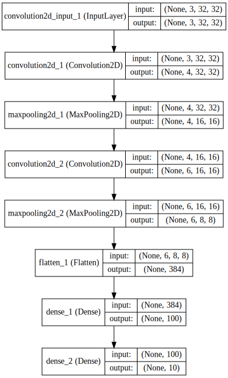
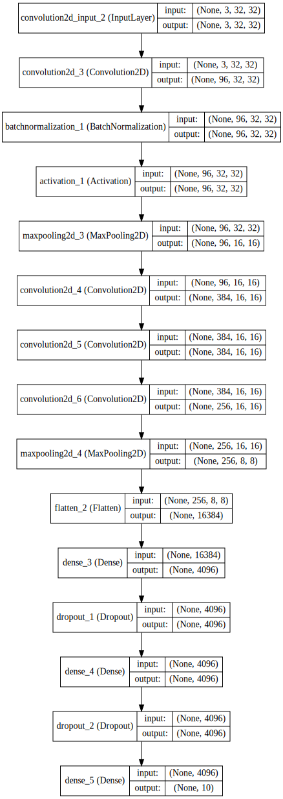
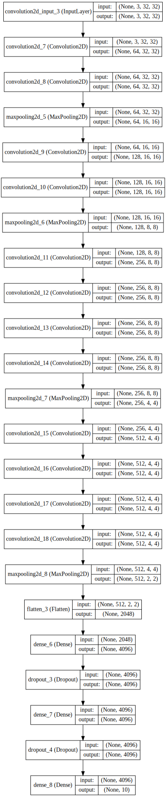
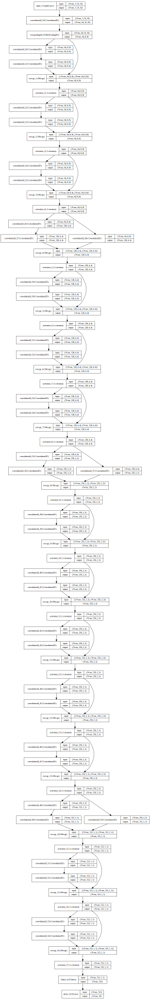

```python
import network
```

    Using Theano backend.
    Using gpu device 0: Tesla K40m (CNMeM is disabled, cuDNN 5004)


```python
from keras.utils.visualize_util import model_to_dot, plot
from IPython.display import SVG
from keras.utils import np_utils
from keras.callbacks import EarlyStopping
from matplotlib import pyplot as plt
%matplotlib inline
plt.style.use("ggplot")
import random
```


```python
lenet = network.lenet()

SVG(model_to_dot(lenet, show_shapes=True).create(prog='dot', format='svg'))
```





```python
alexnet = network.alexnet()

SVG(model_to_dot(alexnet, show_shapes=True).create(prog='dot', format='svg'))
```





```python
vggnet = network.vggnet()

SVG(model_to_dot(vggnet, show_shapes=True).create(prog='dot', format='svg'))
```





```python
resnet = network.resnet()

SVG(model_to_dot(resnet, show_shapes=True).create(prog='dot', format='svg'))
```





```python
from keras.datasets import cifar10

batch_size = 128
nb_epoch = 50

(X_train, y_train), (X_test, y_test) = cifar10.load_data()
Y_train = np_utils.to_categorical(y_train, 10)
Y_test = np_utils.to_categorical(y_test, 10)

X_train = X_train.astype('float32')
X_test = X_test.astype('float32')
X_train /= 255
X_test /= 255

early_stop = EarlyStopping(patience=2)
```


```python
random.seed(1405)
lenet.compile(loss='categorical_crossentropy', optimizer='adam', metrics=['accuracy'])
lehis = lenet.fit(X_train, Y_train,
              batch_size=batch_size,
              nb_epoch=nb_epoch,
              validation_data=(X_test, Y_test))
```

    Train on 50000 samples, validate on 10000 samples
    Epoch 1/100
    50000/50000 [==============================] - 3s - loss: 1.6270 - acc: 0.4669 - val_loss: 1.6115 - val_acc: 0.4631
    Epoch 2/100
    50000/50000 [==============================] - 3s - loss: 1.5949 - acc: 0.4721 - val_loss: 1.6454 - val_acc: 0.4494
    Epoch 3/100
    50000/50000 [==============================] - 3s - loss: 1.6342 - acc: 0.4536 - val_loss: 1.5960 - val_acc: 0.4610
    Epoch 4/100
    50000/50000 [==============================] - 3s - loss: 1.6024 - acc: 0.4652 - val_loss: 1.5850 - val_acc: 0.4550
    Epoch 5/100
    50000/50000 [==============================] - 3s - loss: 1.6815 - acc: 0.4275 - val_loss: 1.6952 - val_acc: 0.4258
    Epoch 6/100
    50000/50000 [==============================] - 3s - loss: 1.6162 - acc: 0.4510 - val_loss: 1.6241 - val_acc: 0.4483
    Epoch 7/100
    50000/50000 [==============================] - 3s - loss: 1.6085 - acc: 0.4501 - val_loss: 1.6283 - val_acc: 0.4519


```python
random.seed(1405)
alexnet.compile(loss='categorical_crossentropy', optimizer='adam', metrics=['accuracy'])
alexhis = alexnet.fit(X_train, Y_train,
              batch_size=batch_size,
              nb_epoch=nb_epoch,
              validation_data=(X_test, Y_test))
```

    Train on 50000 samples, validate on 10000 samples
    Epoch 1/100
     6784/50000 [===>..........................] - ETA: 401s - loss: 14.3289 - acc: 0.0982


    ---------------------------------------------------------------------------

    KeyboardInterrupt                         Traceback (most recent call last)

    <ipython-input-12-038f9e9f6fd6> in <module>()
          4               batch_size=batch_size,
          5               nb_epoch=nb_epoch,
    ----> 6               validation_data=(X_test, Y_test), callbacks=[early_stop])
    

    /home/s1621639/.anyenv/envs/pyenv/versions/anaconda3-4.0.0/lib/python3.5/site-packages/keras/models.py in fit(self, x, y, batch_size, nb_epoch, verbose, callbacks, validation_split, validation_data, shuffle, class_weight, sample_weight, **kwargs)
        400                               shuffle=shuffle,
        401                               class_weight=class_weight,
    --> 402                               sample_weight=sample_weight)
        403 
        404     def evaluate(self, x, y, batch_size=32, verbose=1,


    /home/s1621639/.anyenv/envs/pyenv/versions/anaconda3-4.0.0/lib/python3.5/site-packages/keras/engine/training.py in fit(self, x, y, batch_size, nb_epoch, verbose, callbacks, validation_split, validation_data, shuffle, class_weight, sample_weight)
       1028                               verbose=verbose, callbacks=callbacks,
       1029                               val_f=val_f, val_ins=val_ins, shuffle=shuffle,
    -> 1030                               callback_metrics=callback_metrics)
       1031 
       1032     def evaluate(self, x, y, batch_size=32, verbose=1, sample_weight=None):


    /home/s1621639/.anyenv/envs/pyenv/versions/anaconda3-4.0.0/lib/python3.5/site-packages/keras/engine/training.py in _fit_loop(self, f, ins, out_labels, batch_size, nb_epoch, verbose, callbacks, val_f, val_ins, shuffle, callback_metrics)
        766                 batch_logs['size'] = len(batch_ids)
        767                 callbacks.on_batch_begin(batch_index, batch_logs)
    --> 768                 outs = f(ins_batch)
        769                 if type(outs) != list:
        770                     outs = [outs]


    /home/s1621639/.anyenv/envs/pyenv/versions/anaconda3-4.0.0/lib/python3.5/site-packages/keras/backend/theano_backend.py in __call__(self, inputs)
        491     def __call__(self, inputs):
        492         assert type(inputs) in {list, tuple}
    --> 493         return self.function(*inputs)
        494 
        495 


    /home/s1621639/.anyenv/envs/pyenv/versions/anaconda3-4.0.0/lib/python3.5/site-packages/theano/compile/function_module.py in __call__(self, *args, **kwargs)
        857         t0_fn = time.time()
        858         try:
    --> 859             outputs = self.fn()
        860         except Exception:
        861             if hasattr(self.fn, 'position_of_error'):


    KeyboardInterrupt: 


```python
random.seed(1405)
vggnet.compile(loss='categorical_crossentropy', optimizer='adam', metrics=['accuracy'])
vgghis = vggnet.fit(X_train, Y_train,
              batch_size=batch_size,
              nb_epoch=nb_epoch,
              validation_data=(X_test, Y_test))
```


```python
random.seed(1405)
resnet.compile(loss='categorical_crossentropy', optimizer='adam', metrics=['accuracy'])
reshis = resnet.fit(X_train, Y_train,
              batch_size=batch_size,
              nb_epoch=nb_epoch,
              validation_data=(X_test, Y_test))
```

    Train on 50000 samples, validate on 10000 samples
    Epoch 1/100
    50000/50000 [==============================] - 327s - loss: 1.9597 - acc: 0.2808 - val_loss: 1.6930 - val_acc: 0.3820


```python
x = range(nb_epoch)
plt.plot(x, lehis.history['acc'], label="LeNet train")
plt.plot(x, lehis.history['val_acc'], label="LeNet val")
plt.plot(x, alexhis.history['acc'], label="AlexNet train")
plt.plot(x, alexhis.history['val_acc'], label="AlexNet val")
plt.plot(x, vgghis.history['acc'], label="VGGNet train")
plt.plot(x, vgghis.history['val_acc'], label="VGGNet val")
plt.plot(x, reshis.history['acc'], label="ResNet train")
plt.plot(x, reshis.history['val_acc'], label="ResNet val")
plt.title("accuracy")
plt.legend(loc='center left', bbox_to_anchor=(1, 0.5))
plt.show()

plt.plot(x, lehis.history['loss'], label="LeNet train")
plt.plot(x, lehis.history['val_loss'], label="LeNet val")
plt.plot(x, alexhis.history['loss'], label="AlexNet train")
plt.plot(x, alexhis.history['val_loss'], label="AlexNet val")
plt.plot(x, vgghis.history['loss'], label="VGGNet train")
plt.plot(x, vgghis.history['val_loss'], label="VGGNet val")
plt.plot(x, reshis.history['loss'], label="ResNet train")
plt.plot(x, reshis.history['val_loss'], label="ResNet val")
plt.title("loss")
plt.legend(loc='center left', bbox_to_anchor=(1, 0.5))
plt.show()
```
